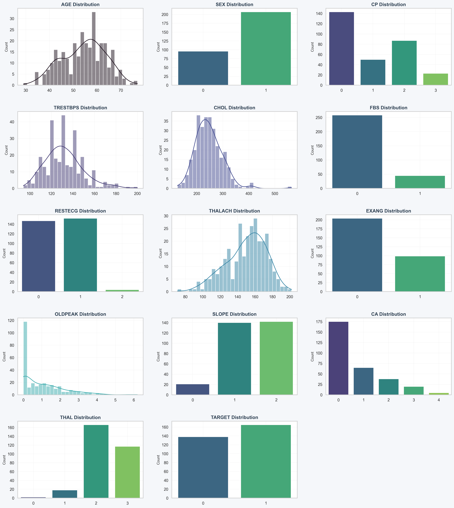

# 🫀 Heart Disease Risk Prediction using Machine Learning

## 📌 Project Overview

This project presents a systematic comparative study of multiple machine learning classification algorithms for predicting the presence of heart disease using clinical attributes. 

Several models were evaluated, and **Logistic Regression** was selected as the optimal model based on quantitative performance metrics.

The final model is deployed as an interactive web application using Streamlit and hosted on Hugging Face Spaces.

---

## 🎯 Research Objective

Early detection of cardiovascular disease significantly improves treatment outcomes and survival rates. 

The objective of this study was to:
- Perform preprocessing and feature analysis on a clinical heart disease dataset
- Compare multiple classification algorithms
- Evaluate models using standard performance metrics
- Select the most reliable and interpretable model

---

## 📊 Dataset

- Source: UCI Heart Disease Dataset
- 13 clinical input features
- Binary classification:
  - 1 → No Heart Disease
  - 0 → Heart Disease Present

---

## 📊 Feature Distribution Visualization
The following visualization shows the distribution of key clinical features used for model training:

---

## 🧠 Algorithms Compared

- Logistic Regression
- Naive Bayes
- Support Vector Machine (Linear)
- K-Nearest Neighbors
- Decision Tree
- Random Forest
- XGBoost
- Artificial Neural Network (1 Hidden Layer)

---

## 📈 Model Evaluation

Models were evaluated using:

- Accuracy
- Precision
- Recall
- F1-Score
- Cross-validation

After comparative analysis, **Logistic Regression** demonstrated strong performance with high interpretability and stability, making it the selected model for deployment.

---

## 🚀 Deployment

The final Logistic Regression model is deployed as an interactive Streamlit web application.

🔗 **Live Application:**  
https://heart-disease-risk-prediction25.streamlit.app

---

## 🛠 Tech Stack

- Python
- Scikit-learn
- Streamlit
- Pandas
- NumPy

---
## 📂 Repository Structure
```
Heart-Disease-Risk-Prediction/
│
├── app.py                  # Streamlit web application
├── model_training.ipynb    # Model training & comparison
├── best_model.pkl          # Saved Logistic Regression model
├── heart.csv               # Dataset
├── requirements.txt        # Dependencies
└── README.md               # Documentation
```
---

## ⚠ Disclaimer

This project is intended for educational and research purposes only and is not a substitute for professional medical diagnosis.
